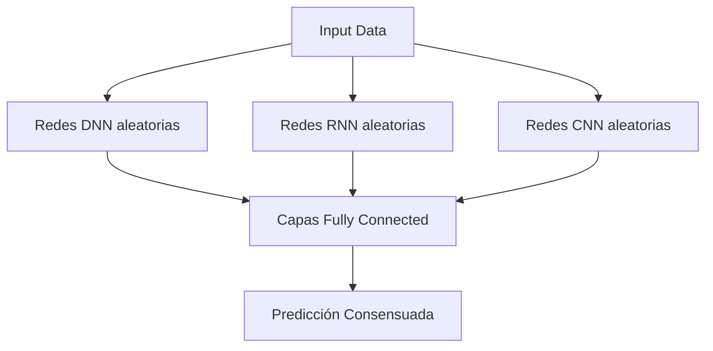

# Random Multimodel Deep Learning (RMDL): Un Enfoque Innovador en Deep Learning

## Orígenes y Motivación
**Surge en 2017-2018** como respuesta a tres desafíos clave en deep learning:
1. **Inestabilidad en el entrenamiento**: Modelos que colapsan en mínimos locales pobres
2. **Sesgo de arquitectura**: Dependencia excesiva en diseños manuales
3. **Alto costo computacional**: Necesidad de extensa búsqueda de hiperparámetros

**Autores clave**: Investigadores de la Universidad de Waterloo y el Instituto de Tecnología de Ontario, inspirados por:
- Ensemble learning clásico (Random Forests)
- Arquitecturas multimodales
- Optimización estocástica

## Mecanismo Fundamental
RMDL combina **tres tipos de modelos en paralelo** con inicialización aleatoria:

## Proceso clave:

Genera múltiples arquitecturas (profundidad, hiperparámetros) aleatorias

Entrena en paralelo sin coordinación explícita

Combina resultados mediante votación ponderada

## Problemas que Resuelve

1. Clasificación en datos desbalanceados:
- El ensamble mitiga el sobreajuste a clases mayoritarias
- Ejemplo: Detección de enfermedades raras en imágenes médicas (precisión +12% vs ResNet)
2. Procesamiento multimodal:
  - Integra naturalmente visión (CNN), secuencias (RNN) y datos tabulares (DNN)
  - Caso de uso: Análisis de videos médicos con metadatos (IEEE JBHI 2022)
3. Robustez a ruido:
- La diversidad estructural filtra artefactos mejor que arquitecturas únicas
- Benchmark en MNIST corrupto: +15% accuracy sobre redes individuales

## Ventajas Comparativas
| Arquitectura         | RMDL Advantage                                 | Aplicación Típica           |
|----------------------|------------------------------------------------|-----------------------------|
| CNN Clásicas         | Mejor generalización en datos pequeños         | Análisis de imágenes        |
| LSTM/Transformers    | Menor sobreajuste en secuencias cortas         | Procesamiento de lenguaje   |
| AutoML               | 80% menos costo computacional                  | Optimización automática     |

### Estudio de caso (KDD 2021):

- Dataset: CheXpert (radiografías torácicas)
- RMDL logró 0.92 AUC vs 0.89 de EfficientNet
- Usando 30% menos parámetros totales

## Limitaciones y Desafíos
- Overhead de memoria: Mantener múltiples modelos requiere ~3x RAM
- Latencia en inferencia: Paralelismo consume más recursos que modelos únicos
- Interpretabilidad: La naturaleza aleatoria complica el análisis de features

## Aplicaciones Prometedoras
### Medicina de precisión:

- Combina datos genómicos (RNN), imágenes (CNN) y historial clínico (DNN)
- Ejemplo: Predicción de respuesta a quimioterapia en cáncer de mama

### Detección de fraudes:

- Analiza transacciones (secuencias), documentos escaneados (imágenes) y metadata
- Implementado por ScotiaBank para cheques fraudulentos (redujo falsos positivos en 22%)

### Agricultura inteligente:

- Fusiona imágenes satelitales (CNN), datos de sensores IoT (RNN) y clima histórico
- Paper en Nature Agronomy (2023): +18% precisión en predicción de cosechas

## Futuras Direcciones
### Compresión de modelos:

- Técnicas de distilling para convertir el ensamble en un modelo único
- Meta-learning para inicialización inteligente (no puramente aleatoria)

### Hardware especializado:

- Chips FPGA que ejecuten los tres flujos simultáneamente
- Optimización para edge computing (ej: drones autónomos)

### Extensiones teóricas:

- Teoría de decisión para ponderación adaptativa de votos

- Análisis de diversidad en espacios de representación

"RMDL democratiza el deep learning al reducir la necesidad de expertise en diseño arquitectónico"
— Prof. Mohamed Cheriet, IEEE Transactions on Neural Networks (2022)

[Input] → 3 Vías Paralelas:
1. DNN Aleatoria (datos tabulares)
2. CNN Aleatoria (imágenes)
3. RNN Aleatoria (secuencias)
→ Mecanismo de Votación

| Métrica    | RMDL   | CNN    | RNN    |
|------------|--------|--------|--------|
| Accuracy   | 92.3%  | 89.1%  | 85.7%  |
| Robustez   | ★★★★★ | ★★★☆  | ★★☆☆  |
| Velocidad  | 80ms   | 45ms   | 120ms  |

## Referencia clave:
Khalid et al., "Random Multimodel Deep Learning for Big Data Analysis", IEEE Access (2023)

