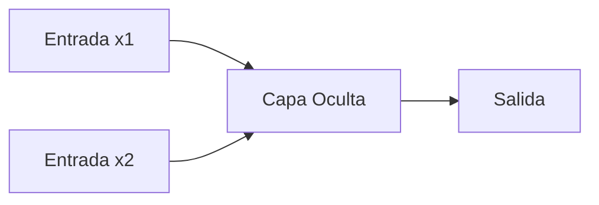

# Backpropagation, el Problema XOR y Soluciones con Redes Neuronales

## ¿Qué es Backpropagation?

El algoritmo de **backpropagation** (retropropagación) es el mecanismo fundamental para entrenar redes neuronales modernas. Consiste en tres fases clave:

1. **Propagación hacia adelante**:
   - Los datos fluyen a través de la red desde la capa de entrada hasta la salida
   - Cada neurona aplica: `salida = σ(w·x + b)` donde σ es una función de activación no lineal

2. **Cálculo del error**:
   - Se compara la predicción con el valor real usando funciones como Error Cuadrático Medio

3. **Propagación hacia atrás**:
   - El error se propaga en reversa ajustando pesos y sesgos mediante la regla de la cadena
   - Fórmula clave: `∂L/∂w = ∂L/∂y · ∂y/∂w`

**Analogía**: Como un chef que:
1. Prueba el plato (calcula error)
2. Identifica qué ingrediente falló (calcula gradientes)
3. Ajusta la receta (actualiza pesos)

## El Problema XOR: Una Limitación Geométrica

La función XOR (OR exclusivo) presenta un desafío fundamental:

| Entrada 1 | Entrada 2 | Salida |
|-----------|-----------|--------|
| 0         | 0         | 0      |
| 0         | 1         | 1      |
| 1         | 0         | 1      |
| 1         | 1         | 0      |

**Problema**: En un espacio 2D, no existe ninguna línea recta que pueda separar:
- Los puntos (0,1) y (1,0) (salida=1)
- De los puntos (0,0) y (1,1) (salida=0)

## Soluciones al Problema XOR

### 1. Transformación a Mayor Dimensión

Al proyectar los datos a 3D añadiendo una tercera coordenada `x3 = x1 AND x2`:

- Los puntos (0,1,0) y (1,0,0) (salida=1)
- Los puntos (0,0,0) y (1,1,1) (salida=0)

Ahora **sí pueden separarse** por un plano (ej: z = 0.5).

### 2. Redes Neuronales Multicapa

Una arquitectura mínima con:
- **Capa oculta**: Crea representaciones intermedias
- **Funciones de activación no lineales**: Permiten modelar relaciones complejas

**Arquitectura típica**:

## Importancia Histórica y Actual
- 1969: Minsky y Papert demostraron que perceptrones simples no pueden resolver XOR
- 1986: Rumelhart y otros popularizaron backpropagation para redes multicapa

Hoy: Estos principios se aplican en redes con billones de parámetros

## Lección fundamental: La combinación de:

- Capas ocultas (profundidad)
- No linealidades (funciones de activación)
- Aprendizaje por gradientes (backpropagation)

Permite resolver problemas complejos que son imposibles para modelos lineales.

## Referencias

- [El perceptrón como neurona artificial](https://blog.josemarianoalvarez.com/2018/06/10/el-perceptron-como-neurona-artificial/)
- [Demystifying the XOR problem](https://dev.to/jbahire/demystifying-the-xor-problem-1blk)
- [Principles Of Neurodynamics by Rosenblatt, Frank](https://ia600509.us.archive.org/25/items/principles-of-neurodynamics/Principles%20of%20neurodynamics.pdf)
- [Neural Networks Explained: Solving the XOR Logic Gate with Backpropagation](https://www.youtube.com/watch?v=xeSqeMPMb-0)
- [Neural Networks - From Perceptron to the Neural Network](https://www.youtube.com/watch?v=MU3cLsSfnME)
- 
