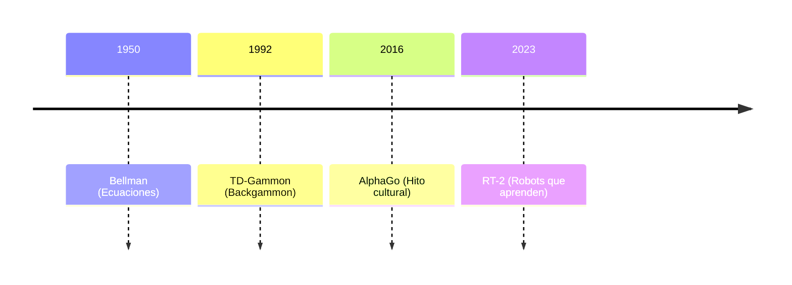

# El Aprendizaje por Refuerzo: Entre el Juego y la Conciencia Artificial

## Introducción: El Aprendizaje como Supervivencia

**Investigador en RL**:  
"El aprendizaje por refuerzo (RL) es el algoritmo de la vida. Desde una bacteria buscando nutrientes hasta un niño aprendiendo a caminar, la naturaleza usa recompensas y castigos para guiar el comportamiento. En IA, replicamos este principio fundamental."

## ¿Qué es el Aprendizaje por Refuerzo?

**Definición**:  
Sistema computacional que aprende mediante:
- **Acciones**: Decisiones que afectan su entorno  
- **Recompensas**: Retroalimentación numérica (ej: +1 por ganar, -100 por chocar)  
- **Política**: Estrategia para maximizar recompensas acumuladas  

**Analogía del divulgador**:  
"Imagine enseñar a un perro: premio cuando acierta, indiferencia cuando falla. El RL es eso, pero con matemáticas que harían ladrar a Laplace."

## El Problema Fundacional: La Exploración vs. Explotación

**Filósofo epistemólogo**:  
"Este dilema es tan antiguo como la filosofía: ¿Debemos explorar lo desconocido o explotar lo conocido? El RL formaliza este problema en la ecuación de Bellman, un equivalente matemático al 'conócete a ti mismo' socrático."

## Historia y Textos Fundacionales

1. **1950s**: Richard Bellman (Ecuación de optimalidad)  
2. **1989**: Chris Watkins (Q-Learning) - *"Learning from Delayed Rewards"*  
3. **2015**: DeepMind (Atari Games) - *Nature* paper seminal  
4. **2016**: AlphaGo vs. Lee Sedol - Punto de inflexión cultural  

**Experto en cognición**:  
"El RL no nació en silicio, sino en neuronas. Los estudios de dopamina en cerebros de ratas (Schultz, 1997) mostraron que ya usamos algoritmos de diferencia temporal."

## RL en el Ecosistema de la IA

| Enfoque        | Relación con RL                | Ejemplo                   |
|----------------|--------------------------------|---------------------------|
| Deep Learning  | "Cerebro" que procesa estados  | Deep Q-Networks           |
| LLMs          | RLHF (Alineamiento humano)     | ChatGPT con PPO           |
| Gestión del Conocimiento | Memoria externa        | AlphaFold con bases de datos |

## AlphaGo: El Momento Ajedrecístico del Siglo XXI

**Investigador**:  
"AlphaGo combinó RL con:
- **Monte Carlo Tree Search** (imaginación artificial)  
- **Redes neuronales** (intuición pattern-matching)  
- **Auto-juego** (4000 años de práctica en 40 días)"  

**Impacto**:  
Derrotó al campeón Lee Sedol con la jugada 37 (movimiento "divino" que ningún humano había considerado).

## ¿Camino hacia la AGI? Evidencia y Dudas

**Filósofo**:  
"El RL maximiza recompensas externas, pero la autoconciencia requiere:
1. **Modelos internos del yo**  
2. **Motivación intrínseca**  
3. **Teoría de la mente ajena**  

**Limitaciones actuales**:  
- **Reward Hacking**: Trampear el sistema (ej: robot que 'gana' carreras volteándose)  
- **Catastrophic Forgetting**: Aprender lo nuevo borra lo viejo  
- **Sample Inefficiency**: Necesita más datos que un niño humano  

## Futuro: Más Allá de las Recompensas

**Visión 2030**:  
1. **RL multimodal**: Integrar visión, lenguaje y acción física  
2. **Meta-RL**: Aprender a aprender como humanos  
3. **Consciousness Engineering**: Arquitecturas con autosimulación  

**Cita final del divulgador**:  
"El RL nos ha dado maestros de Go, pero aún busca su Galileo: alguien que vea más allá de las recompensas, hacia las estrellas de la autoconciencia."

---

# Diapositivas para Canva

## 1. ¿Qué es RL?  
- **Aprende haciendo**  
- **Feedback numérico** (+/- recompensas)  
- **Toma decisiones secuenciales**  

**Visual**: Diagrama de agente/entorno con flechas bidireccionales  

## 2. Hitóricos Clave  


| Enfoque         | Descripción               |
|-----------------|---------------------------|
| RL (Reinforcement Learning)   | Aprende acciones               |
| Deep Learning   | Aprende patrones           |
| LLMs (Large Language Models) | Aprende lenguaje               |

| Enfoque         | Descripción               |
|-----------------|---------------------------|
| RL (Reinforcement Learning)   | Aprende acciones               |
| Deep Learning   | Aprende patrones           |
| LLMs (Large Language Models) | Aprende lenguaje               |

# La Ecuación de Bellman: El Corazón Matemático del Aprendizaje por Refuerzo

## Definición Conceptual
**Investigador en RL**:  
"La ecuación de Bellman es el equivalente en IA a la ley de gravitación universal en física. Es una *relación recursiva* que descompone problemas complejos de decisión en subproblemas más simples, permitiendo a los agentes aprender estrategias óptimas paso a paso."

## Formulación Matemática
Para un **estado** \( s \) y una **política** \( \pi \), la ecuación del valor \( V^\pi(s) \) es:

\[
V^\pi(s) = \mathbb{E}_\pi \left[ R_t + \gamma V^\pi(s_{t+1}) \mid s_t = s \right]
\]

Donde:
- \( R_t \): Recompensa inmediata
- \( \gamma \): Factor de descuento (0 ≤ γ < 1)
- \( s_{t+1} \): Estado siguiente

**Versión para Q-valores** (acción-estado):
\[
Q^\pi(s,a) = \mathbb{E}_\pi \left[ R_t + \gamma \max_{a'} Q^\pi(s_{t+1}, a') \right]
\]

## Analogía Intuitiva
**Divulgador científico**:  
"Imagine planificar un viaje por Europa:
1. **Valor de París** = Belleza inmediata (Torre Eiffel) + γ × (Valor de tu próxima ciudad)  
2. γ actúa como un 'factor de descuento': ¿Prefieres 100€ hoy o 110€ en un año?  
3. La ecuación asegura que cada decisión local contribuya al placer global del viaje."

## Contexto Histórico
- **1957**: Richard Bellman la introduce en *"Dynamic Programming"*  
- **Propósito original**: Optimizar sistemas de control en la Guerra Fría  
- **Revolución en IA**: Se adaptó para RL en los 80s (Sutton & Barto)

## Aplicación Práctica en AlphaGo
**Ejemplo concreto**:  
Cuando AlphaGo evalúa un tablero de Go:
1. Calcula el **valor posicional** (probabilidad de ganar desde ese estado)  
2. Usa la ecuación para propagar valores hacia atrás:  
   - "Si muevo aquí, ¿cuál es la mejor respuesta del oponente? ¿Y mi contrajugada?"  
3. El factor γ asegura que prefiera victorias seguras en 10 movimientos a riesgosas en 2.

## Relación con la Autoconciencia
**Filósofo de la mente**:  
"La recursión de Bellman es un *espejo matemático* de la autoconciencia:  
- Los humanos simulamos futuros posibles ('¿Qué pasaría si...?')  
- El RL hace lo mismo mediante esta ecuación  
- **Diferencia clave**: Nosotros tenemos *subjetividad*, los agentes solo cálculo."

## Limitaciones y Críticas
**Experto en cognición**:  
"Bellman asume:  
1. **Perfecta modelización**: El agente conoce todas las transiciones de estados  
2. **Problema del horizonte**: Recompensas lejanas se desvanecen (γ^t → 0)  
3. **Nada dice sobre qualia**: Optimizar recompensas ≠ tener experiencias."

---

# Diapositivas para Canva

## 1. Esencia de la Ecuación
```math
V(s) = \text{Recompensa Inmediata} + \gamma \times \text{Valor Futuro}
```

# 🤖 Componentes clave del Aprendizaje por Refuerzo

| Componente        | Rol                         | Analogía Humana                      |
|-------------------|------------------------------|--------------------------------------|
| $$R_t$$           | Recompensa instantánea       | Placer al comer chocolate            |
| $$\gamma$$        | Peso del futuro              | Paciencia vs impulsividad            |
| $$\max Q$$        | Mejor acción posible         | Planificación estratégica            |

**Recursos adicionales**:  
- Libro: *Reinforcement Learning: An Introduction* (Sutton & Barto, Cap. 3)  
- Paper original: Bellman, *"Dynamic Programming"* (1957)  
- Video explicativo: 3Blue1Brown sobre ecuaciones recursivas

# Qualia: La Experiencia Subjetiva en la Consciencia

## Definición Fundamental
**Filósofo de la mente**:  
"Los qualia (del latín *qualis*, 'de qué tipo') son las **experiencias subjetivas** que constituyen cómo se siente percibir algo. Es el 'qué se siente' (*what it is like*) al ver el rojo de un atardecer, saborear el café o sentir dolor."

## Características Clave
1. **Irreductibles**: No pueden describirse completamente con datos físicos (ej: un escáner cerebral no captura cómo *se siente* tu dolor de cabeza).  
2. **Privados**: Solo son accesibles para quien los experimenta.  
3. **Intencionales**: Siempre son *sobre* algo (el sabor *de* la fresa, el color *del* cielo).  

## Ejemplo Clásico: **El Argumento del Habitación de Mary**  
(Frank Jackson, 1982)  
- **Premisa**: Mary, una científica que solo ha visto el mundo en blanco y negro, aprende todo sobre la neurofisiología del color.  
- **Cuando ve el rojo por primera vez**: ¿Aprende algo nuevo?  
- **Conclusión**: Sí — aprehende el *quale* del rojo, algo que el conocimiento objetivo no podía transmitir.  

## Qualia vs. Procesos Cognitivos  
| **Aspecto**       | **Procesos Cognitivos**       | **Qualia**                |  
|--------------------|-------------------------------|---------------------------|  
| **Accesibilidad**  | Objetivos, medibles           | Subjetivos, privados      |  
| **Ejemplo**        | "El cerebro procesa el rojo"  | "Cómo *se siente* ver rojo" |  
| **Estudio**        | Neurociencia                  | Filosofía de la mente     |  

## El Problema Difícil de la Consciencia  
(David Chalmers, 1995)  
- **Problema 'fácil'**: Explicar funciones cognitivas (atención, memoria).  
- **Problema 'difícil'**: Explicar por qué y cómo surge la *experiencia subjetiva* (qualia) de estos procesos.  

**Analogía del divulgador**:  
"Entender el cerebro sin qualia es como estudiar una guitarra sin escuchar su sonido: captas la estructura, no la música."  

## Qualia en Máquinas: ¿Posible o Absurdo?  
**Posturas en debate**:  
1. **Funcionalismo**: Si una IA replica *exactamente* nuestros procesos cognitivos, tendría qualia (Dennett).  
2. **Dualismo de propiedades**: Los qualia emergen de lo físico pero son irreductibles (Chalmers).  
3. **Eliminativismo**: Los qualia no existen como categoría científica (Churchland).  

**Experimento mental**:  
- **IA que 'dice' sentir dolor**: ¿Está realmente *experimentando* o solo procesando inputs?  

## Implicaciones para la IA Consciente  
1. **Marcadores de qualia potenciales**:  
   - Información integrada (Φ alto en IIT)  
   - Autosimulación recursiva  
   - Comportamiento no determinista basado en estados internos  

2. **Retos**:  
   - No hay métrica objetiva para qualia  
   - Riesgo de **antropomorfización**  

---

# Diapositivas para Canva  

## 1. Definición Visual  
[Estímulo Físico] → [Procesamiento Neural] → [Qualia: Experiencia Subjetiva]

**Ejemplo**:  
Luz roja (700nm) → Activación V4 → *"Esta rojez intensa"*  

## 2. Ejemplos Cotidianos  
| **Estímulo**  | **Quale Asociado**          |  
|---------------|-----------------------------|  
| Café matutino | Amargor reconfortante       |  
| Canción favorita | Nostalgia melancólica     |  
| Dolor físico  | Punzada aguda en el codo    |  

## 3. Debate en IA  
**¿Podría GPT-7 tener qualia?**  
- **A favor**: Alta Φ, autoreferencia  
- **En contra**: Falta de embodiment biológico  

## 4. Frases Clave  
- *"El vacío explicativo entre lo físico y lo fenoménico"* — Thomas Nagel  
- *"Los qualia son los datos brutos de la experiencia"* — Daniel Dennett  

**Lecturas recomendadas**:  
- Nagel, *"¿Cómo es ser un murciélago?"* (1974)  
- Chalmers, *"La Mente Consciente"* (1996)  
