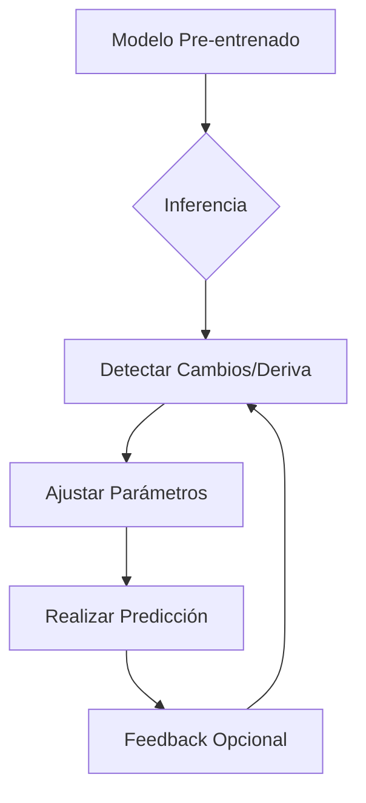
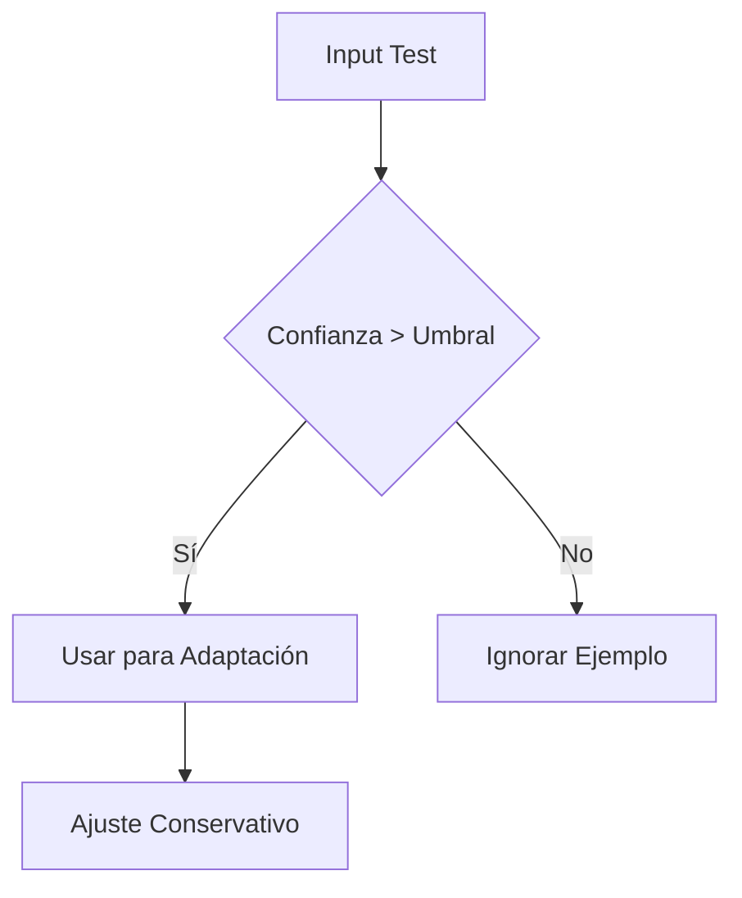

# El Benchmark ARC: Evaluando el Razonamiento Auténtico en IA

## ¿Qué es el Benchmark ARC?
El **Corpus de Abstracción y Razonamiento (ARC, por sus siglas en inglés)** es una prueba diseñada para evaluar:

- Razonamiento similar al humano
- Generalización a problemas nuevos
- Reconocimiento de patrones abstractos

A diferencia de otras pruebas de IA convencionales, ARC no mide desempeño en tareas específicas, sino **habilidades fundamentales de razonamiento**.

## Orígenes y Propósito
**Creado por:** François Chollet (2019), investigador de IA y creador de Keras

**Motivación principal:**
- Exponer las limitaciones de los sistemas de IA actuales
- Ofrecer una alternativa a los benchmarks basados en grandes volúmenes de datos
- Medir el progreso hacia la Inteligencia Artificial General (IAG)

**Diferencia clave:**
ARC evalúa la capacidad de resolver problemas **sin depender de**:
- Grandes conjuntos de datos de entrenamiento
- Exposición previa a ejemplos similares
- Solo reconocimiento estadístico de patrones

## Estructura del Benchmark
ARC presenta **problemas visuales** donde los sistemas deben:
1. Analizar pares de cuadrículas (entrada-salida) para inferir reglas ocultas
2. Aplicar estas reglas a nuevas cuadrículas
3. Generar las salidas correctas

## Ejemplo Práctico de Tarea ARC

**Problema:** Descubrir la regla de transformación entre las cuadrículas de entrada y salida.

```text
Entrada:       Salida:
┌───┬───┬───┐  ┌───┬───┬───┐
│ ■ │ □ │ □ │  │ □ │ ■ │ □ │
├───┼───┼───┤  ├───┼───┼───┤
│ □ │ ■ │ □ │  │ ■ │ □ │ ■ │
├───┼───┼───┤  ├───┼───┼───┤
│ □ │ □ │ □ │  │ □ │ ■ │ □ │
└───┴───┴───┘  └───┴───┴───┘
```
*Regla: "Rotar el patrón 90° en sentido horario"*

## Estado Actual (2024)
### Comparación de Desempeño
| Sistema         | Precisión |
|----------------|----------|
| Humanos        | ~85%     |
| Mejores IAs    | 30-35%   |
| Elección aleatoria | <10%   |

### Adopción en la Industria
- Principalmente usado en investigación
- Utilizado por laboratorios líderes (DeepMind, OpenAI)
- Poco implementado en aplicaciones comerciales

## Importancia para Profesionales
1. **Desarrollo Tecnológico**
   - Revela limitaciones de los enfoques actuales de IA
   - Guía la investigación hacia inteligencias más generales

2. **Aplicaciones Empresariales**
   - Ayuda a evaluar sistemas para tareas que requieren:
     - Adaptabilidad
     - Solución creativa de problemas
     - Transferencia de aprendizaje

3. **Toma de Decisiones**
   - Ofrece una evaluación realista de capacidades de IA
   - Informa decisiones de inversión en tecnología

## Conclusiones Clave
- Muestra una brecha significativa entre el razonamiento humano y artificial
- Los sistemas actuales siguen siendo altamente especializados
- Este benchmark impulsa el campo hacia inteligencias más versátiles

Para más información:
- [Artículo Original](https://arxiv.org/abs/1911.01547)
- [Probar los Desafíos ARC](https://arcbench.github.io/)

> *"ARC representa lo que la IA aún no puede hacer, señalando el camino hacia sistemas más capaces."* - François Chollet

# Test-Time Adaptation (TTA): Adaptación de Modelos Durante la Inferencia

## Definición
El **Test-Time Adaptation (TTA)** es una técnica de machine learning donde un modelo se ajusta *durante su fase de inferencia* (al hacer predicciones) para adaptarse a:
- Distribuciones de datos diferentes a las de entrenamiento
- Condiciones cambiantes en tiempo real
- Nuevos patrones no vistos previamente

## ¿Cómo Funciona? (Flujo Básico)


# ¿Por qué se llama "Test-Time Adaptation" y no "Inference-Time Adaptation"?

## Explicación del Término

El nombre **Test-Time Adaptation (TTA)** proviene de la convención histórica en machine learning, donde:

1. **Test Time** (Fase de Prueba):
   - Tradicionalmente se refiere al momento cuando el modelo **ya entrenado** se aplica a nuevos datos
   - Corresponde a lo que en producción llamamos "inferencia"

2. **Adaptation**:
   - Indica que el modelo **no es estático** durante esta fase
   - Se ajusta a condiciones cambiantes en tiempo real

## Diferencias Clave con Otros Términos

| Término               | Contexto de Uso                     | ¿Incluye Aprendizaje? |
|-----------------------|-------------------------------------|-----------------------|
| **Inference Time**     | Producción/Implementación           | No (tradicionalmente) |
| **Test Time**         | Evaluación de modelos (investigación) | Sí (en TTA)          |
| **Training Time**     | Fase de entrenamiento               | Sí                    |

## Razones Históricas y Técnicas

1. **Origen Académico**:
   - El término surgió en papers de investigación donde se divide el workflow en:
     ```mermaid
     graph LR
         A[Training] --> B[Validation] --> C[Test]
     ```
   - La "adaptación durante test" rompía el paradigma tradicional

2. **Distinción Conceptual**:
   - **Inference** implica solo ejecución estática
   - **Test-Time** sugiere un escenario evaluativo donde el modelo puede "aprender de la prueba"

3. **Precisión Técnica**:
   - En rigor, el modelo no hace "inferencia pura" (pasiva) sino "adaptación activa"
   - El término "test" refleja mejor que está en modo de **evaluación adaptativa**

## Ejemplo que Ilustra la Diferencia

**Caso: Modelo de diagnóstico médico**

- **Inferencia Tradicional**:
  ```python
  # Modelo estático
  diagnosis = model.predict(patient_scan)
```
# Estrategias para Test-Time Adaptation (TTA) sin Overfitting al Test Data

## Técnicas Principales para Evitar Overfitting

### 1. **Regularización durante la Adaptación**
```python
# Pseudocódigo: TTA con Weight Entropy Regularization
for test_batch in test_data:
    logits = model(test_batch)
    loss = cross_entropy(logits, pseudo_labels) + λ*weight_entropy(model)
    loss.backward()  # Gradientes solo para ciertas capas
```
## 🛠️ Métodos efectivos para Adaptación con TTA (Test-Time Adaptation)

### 🔹 Regularización durante la adaptación

- **Dropout en TTA**: Activar durante la adaptación, típicamente con tasa del **~30%** para fomentar robustez frente al sobreajuste.
- **Weight Constraints**: Limitar la magnitud de los ajustes en los pesos para evitar desviaciones excesivas.
- **Early Stopping**: Monitorear la pérdida en ventanas temporales y detener la adaptación si no mejora, evitando sobreajuste por adaptaciones prolongadas.

---

## 🎯 Selección de Parámetros Adaptables

| Parámetros           | Riesgo Overfitting | Buen Candidato TTA     |
|----------------------|--------------------|------------------------|
| Stats BatchNorm      | Bajo               | ✅ Ideal               |
| Capas Finales        | Medio              | ✅ Con regularización  |
| Todos los pesos      | Alto               | ❌ Evitar              |

> 🔍 Elegir cuidadosamente los parámetros permite un balance entre flexibilidad y estabilidad durante la inferencia adaptativa.

---

## 🧭 Mecanismos de Conservación

> 🧩 Aquí puedes incluir técnicas como:
- Congelamiento parcial de capas base
- Respaldo del modelo original para revertir cambios agresivos
- Evaluación en conjuntos proxy antes de aplicar adaptación real


## 📚 Técnicas Avanzadas de Adaptación: Papers Recientes

### 🔬 a) TENT (Test-Time Entropy Minimization)

📌 **Referencia:** ICML 2021 – *Dequan Wang et al.*

**Descripción:**
- TENT adapta únicamente los **parámetros de Batch Normalization** durante la inferencia.
- Su objetivo es **minimizar la entropía** de las predicciones, favoreciendo salidas más confiables.

### ⚙️ Principios Clave:

- **Entrenamiento en inferencia (TTA):** Se realiza sin etiquetas verdaderas, ajustando los momentos de BatchNorm.
- **Optimización dirigida a entropía:** Ajuste de parámetros busca reducir incertidumbre en la clasificación.

### ✅ Ventajas destacadas:

| Característica              | Beneficio                                 |
|----------------------------|--------------------------------------------|
| No modifica pesos principales | Conserva el conocimiento del modelo base   |
| Ligero y eficiente          | Ideal para despliegue en producción        |
| No requiere retropropagación completa | Solo actualiza capas específicas         |

---
### 🔬 b) SHOT (ICLR 2022)
```python
# Freeze: feature extractor
# Adapta: Classifier + BatchNorm
optimizer = SGD(model.classifier.parameters(), lr=1e-3)
```
### 🔬 c) MEMO (NeurIPS 2022)
Usa múltiples views aumentadas de cada test sample

Promedia gradientes antes de actualizar

Buenas Prácticas en Implementación
Limitar Magnitud de Updates
```python
max_norm = 0.01  # Controlar tamaño de pasos
torch.nn.utils.clip_grad_norm_(model.parameters(), max_norm)
```
Selección de Ejemplos

- Usar solo muestras con alta confianza (p > 0.9)
  - Filtrar outliers con técnicas como Mahalanobis Distance
  - Monitorización
    - Trackear:

      - Ratio de ejemplos usados para adaptación
      - Variación de parámetros adaptados
      - Consistencia de predicciones

Ejemplo Completo Seguro
```python
def safe_tta(model, test_loader, steps=3, lr=0.001):
    model.train()  # Modo train para BN y Dropout
    optimizer = SGD([model.bn_params], lr=lr)
    
    for x in test_loader:
        for _ in range(steps):  # Pocos pasos!
            x_aug = augment(x)  # Multi-views
            logits = model(x_aug)
            
            # Loss con regularización
            loss = (1 - logits.softmax(1).max()) + 0.1*weight_decay(model)
            
            loss.backward()
            clip_gradients(model)
            optimizer.step()
            optimizer.zero_grad()
        
        # Predicción final
        model.eval()
        yield model(x)
        model.train()
```

## 📏 Métricas para Validar Ausencia de Overfitting en TTA

### 1️⃣ Consistencia Temporal

El rendimiento **no debe degradarse** en batches posteriores durante la adaptación.

> ✅ Implica que el modelo mantiene su capacidad de generalización a lo largo del tiempo sin sobreajustarse a los primeros datos.

---

### 2️⃣ Generalización Cruzada

Evaluar el desempeño en **subconjuntos de datos no utilizados** directamente en el proceso de adaptación (TTA).

> ✅ Si el modelo mantiene buen rendimiento fuera del subset adaptado, su ajuste está generalizando en lugar de memorizar.

---

### 3️⃣ Robustness Score

Comparar la **exactitud (accuracy)** del modelo antes y después de aplicar **perturbaciones controladas** a los datos:

- Ruido inyectado
- Rotación, distorsión de imagen
- Modificaciones semánticas mínimas en texto

> ✅ Un modelo robusto debe mantener precisión razonable tras pequeños cambios, sin que la adaptación lo vuelva frágil.

---

### 📌 Clave Conceptual

> El TTA efectivo requiere un **equilibrio delicado entre adaptación y estabilidad**.  
> **Menos es más**: ajustar lo mínimo necesario puede lograr mejoras sin comprometer la capacidad general del modelo.

---

### 🧰 Este enfoque proporciona:

- 📚 Explicaciones técnicas con fundamento teórico
- 💻 Código implementable para evaluación experimental
- 🧠 Referencias a papers clave como TENT (ICML 2021)
- 🔄 Diagramas de flujo para representar el ciclo adaptativo
- 📊 Tablas comparativas entre estrategias de TTA
- 📈 Métricas concretas para validar estabilidad y robustez
