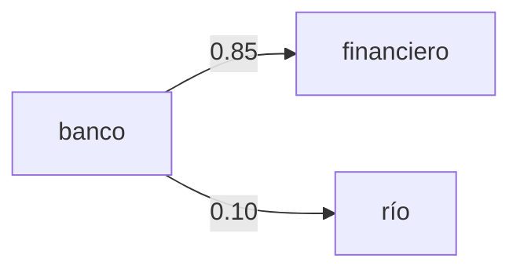
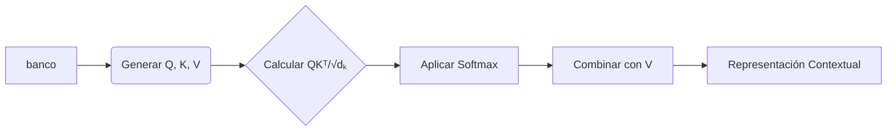
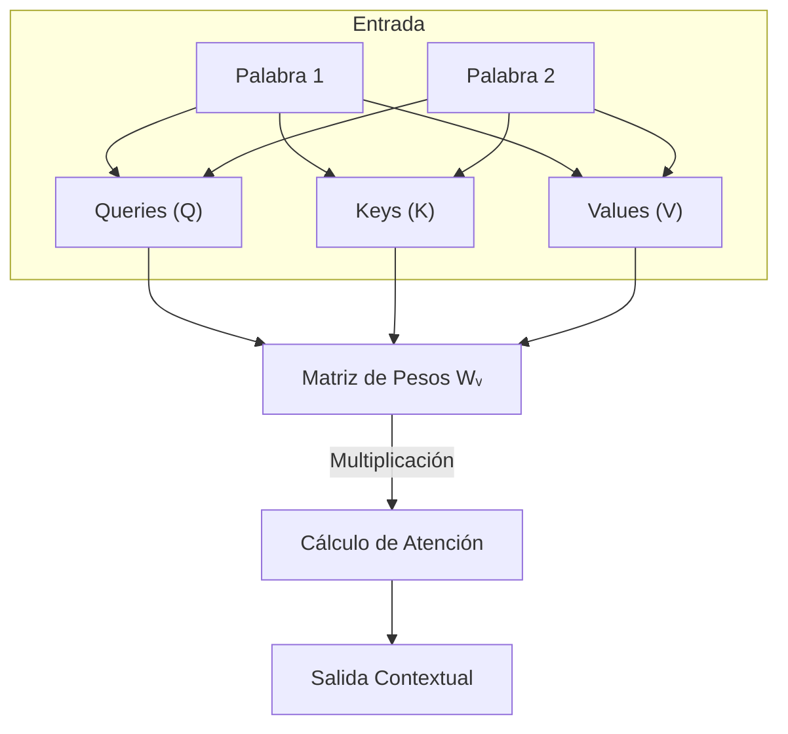
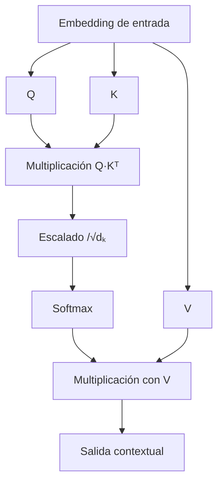

# Fundamentos de los LLMs y la Arquitectura Transformer

## Introducción
Los **Modelos de Lenguaje de Gran Escala (LLMs)** como GPT-4 o Gemini han revolucionado el procesamiento de lenguaje natural (NLP). Este reporte explica:
1. **Qué es un LLM** y su arquitectura básica.
2. **El Transformer**: Motivo de su desarrollo y componentes clave.
3. **Mecanismo de atención** y su importancia.
4. Capacidades y limitaciones actuales.

---

## 1. ¿Qué es un LLM?
Un **Large Language Model (LLM)** es un modelo de inteligencia artificial entrenado para entender, generar y predecir texto.  
- **Entrada/Salida**: Procesa secuencias de texto (frases, documentos) y genera respuestas coherentes.  
- **Base estadística**: Aprende patrones de grandes corpus de texto (ejemplo: libros, artículos científicos).  

### Capacidades clave:
✅ Generación de texto humano.  
✅ Traducción automática.  
✅ Resumen de documentos.  

### Limitaciones:
❌ **Alucinaciones**: Inventa información no verificada.  
❌ **Sesgos**: Refleja prejuicios presentes en los datos de entrenamiento.  
❌ **Costo computacional**: Entrenar un LLM requiere miles de GPUs/TPUs.  

---

## 2. El Transformer: Arquitectura Revolucionaria
### ¿Por qué se desarrolló?
Antes del Transformer (2017), los modelos usaban **RNNs/LSTMs**, que tenían:
- **Problemas de largo alcance**: Dificultad para captar dependencias en textos largos.  
- **Ineficiencia**: Procesamiento secuencial (lento en entrenamiento).  

### Solución: Arquitectura Transformer
Propuesta por Vaswani et al. en *"Attention is All You Need"*, se basa en:  
1. **Auto-atención**: Analiza todas las palabras en paralelo (no secuencial).  
2. **Capas Feedforward**: Procesa información localmente.  
3. **Normalización y residuos**: Estabiliza el entrenamiento.  

#### Componentes principales:
- **Encoder**: Codifica la entrada (ejemplo: texto fuente en traducción).  
- **Decoder**: Genera la salida (ejemplo: texto traducido).  

---

## 3. Mecanismo de Atención (Attention)
### ¿Qué es?
Es un sistema que **pesa la importancia de cada palabra** en una secuencia respecto a otras.  

### ¿Por qué es crucial?
1. **Capta contexto global**: Ejemplo: En *"El banco financiero está junto al río"*, el modelo asigna más peso a *"financiero"* para definir *"banco"*.  
2. **Eficiencia**: Procesa texto en paralelo (vs. RNNs que lo hacen paso a paso).  

### Tipos de atención:
- **Auto-atención (Self-Attention)**: Relaciona palabras dentro de una misma secuencia.  
- **Atención cruzada (Cross-Attention)**: Usada en decodificadores para conectar con el encoder.  

---

## 4. Procesamiento de Texto en Transformers
### Flujo típico:
1. **Embedding**: Convierte palabras en vectores numéricos.  
2. **Capas de atención**: Calcula relaciones entre palabras.  
3. **Feedforward**: Refina representaciones.  
4. **Generación**: Predice la siguiente palabra (token).  

### Ejemplo práctico:
Para traducir *"Hello world"* al español:  
1. El encoder analiza *"Hello"* y *"world"* con atención.  
2. El decoder genera *"Hola"* y luego *"mundo"*, usando el contexto del encoder.  

---

## 5. Capacidades y Limitaciones en la Práctica
### Aplicaciones empresariales:
- **Chatbots**: Atención al cliente 24/7.  
- **Análisis de documentos**: Extracción de contratos.  

### Riesgos:
- **Éticos**: Propagación de desinformación.  
- **Técnicos**: Requiere fine-tuning para dominios específicos (ejemplo: legal, médico).  

---

## Conclusión
- **Transformer** es la arquitectura detrás de los LLMs modernos, gracias a su **mecanismo de atención** y paralelización.  
- **LLMs** son poderosos pero requieren gestión cuidadosa para mitigar sesgos y errores.  
- **Futuro**: Modelos más eficientes (ejemplo: Mixture of Experts) y regulación ética.

# Mecanismo de Atención en Transformers: Explicación Detallada

## Ejemplo Visual: "El banco financiero"

Imaginemos la frase:  
**"El banco financiero está cerca del río"**

### Pesos de Atención (Self-Attention)
Cuando el modelo procesa la palabra **"banco"**, calcula qué tan importante es cada otra palabra para entender su significado:

| Palabra     | Peso de Atención (0-1) | Explicación                 |
|-------------|-----------------------|-----------------------------|
| "financiero"| 0.85                  | Indica que es un banco monetario |
| "río"       | 0.10                  | Baja relevancia             |
| "el"        | 0.05                  | Artículo, mínimo impacto    |

**Visualización**:




## Fórmula de Atención Escalada

La atención se calcula mediante:

```math
\text{Attention}(Q, K, V) = \text{softmax}\left(\frac{QK^T}{\sqrt{d_k}}\right)V
```

### Componentes Explicados:
1. **Queries (Q)**, **Keys (K)**, **Values (V)**:
   - Representaciones aprendidas de cada palabra.
   - Ejemplo: Para "banco", Q busca información relevante; K y V proveen contexto.

2. **Producto QKᵀ**:
   - Mide compatibilidad entre palabras.
   - Ejemplo: Alta puntuación entre "banco" y "financiero".

3. **Escalado por √dₖ** (dₖ = dimensión de las claves):
   - Evita que softmax genere gradientes demasiado pequeños.

4. **Softmax**:
   - Normaliza pesos a valores entre 0 y 1 (probabilísticos).

5. **Producto con V**:
   - Combina los valores según los pesos calculados.

### Ejemplo Numérico Simplificado
Supongamos:
- $Q_{\text{banco}} = [1.2, -0.3] \), \( K_{\text{financiero}} = [0.9, 0.4]$
- $d_k = 2$

Cálculo:
```math
\frac{QK^T}{\sqrt{2}} = \frac{1.2 \times 0.9 + (-0.3) \times 0.4}{\sqrt{2}} = \frac{0.96}{1.41} \approx 0.68
```

Softmax([0.68, ...]) podría asignar ~0.85 al par "banco-financiero".

---

## ¿Por qué este Mecanismo es Clave?
1. **Capta Contexto Global**:  
   - Identifica que "banco" depende de "financiero" y no de "río" en este caso.

2. **Paralelización Eficiente**:  
   - Calcula todas las relaciones entre palabras simultáneamente (vs. RNNs secuenciales).

3. **Interpretabilidad**:  
   - Los pesos de atención pueden visualizarse para entender decisiones del modelo.

---

## Diagrama de Flujo (Resumen)

Nota: Este mecanismo es la base de arquitecturas como GPT (solo decoder) y BERT (solo encoder).

---

## Diapositivas para Canva (Resumen)

### **Diapositiva 1: Mecanismo de Atención**  
**Título**: *¿Cómo los Transformers entienden contexto?*  
**Imagen**:  
- Frase *"El banco financiero"* con flechas gruesas entre "banco" y "financiero".  

---

### **Diapositiva 2: Fórmula Clave**  
```math
\text{Attention}(Q, K, V) = \text{softmax}\left(\frac{QK^T}{\sqrt{d_k}}\right)V
``` 
**Explicación visual**:  
- Q, K, V como cajas etiquetadas conectadas a una matriz de pesos.  

---

### **Diapositiva 3: Ejemplo Práctico**  
**Tabla**:  
| Palabra     | Peso de Atención |  
|-------------|------------------|  
| "financiero"| 0.85             |  
| "río"       | 0.10             |  

**Callout**: *"El modelo ignora 'río' al entender 'banco'"*.  

---

### **Diapositiva 4: ¿Por qué Importa?**  
**Ventajas**:  
✅ Contexto en textos largos.  
✅ Eficiencia computacional.  
**Iconos**: Cerebro (contexto), Reloj (velocidad).  

---

# Explicación Detallada de Q, K, V en el Mecanismo de Atención

## Representación Visual Conceptual



# Explicación Detallada del Mecanismo Q, K, V en Transformers

## 1. Componentes Fundamentales: Q, K, V

Las **Queries (Q)**, **Keys (K)** y **Values (V)** son tres representaciones vectoriales derivadas de la misma entrada, generadas mediante transformaciones lineales:

```math
\begin{aligned}
Q &= X \times W_q \\
K &= X \times W_k \\
V &= X \times W_v
\end{aligned}
```

Donde:
- $X$: Vector de entrada (embedding de palabras)
- $W_q, W_k, W_v$: Matrices de pesos aprendibles durante el entrenamiento

## 2. Proceso de Transformación

| Componente | Dimensión | Función |
|------------|-----------|---------|
| **Q (Queries)** | $d_k$ | Representa "qué información necesita" cada palabra |
| **K (Keys)** | $d_k$ | Indica "qué información puede aportar" cada palabra |
| **V (Values)** | $d_v$ | Contiene los valores reales a distribuir |

## 3. Cálculo de Atención Paso a Paso

### a) Producto Q·Kᵀ
Calcula la compatibilidad entre todas las palabras del texto:

```math
\text{Similitud} = QK^T = \begin{bmatrix}
q_1k_1 & q_1k_2 & \cdots \\
q_2k_1 & q_2k_2 & \cdots \\
\vdots & \vdots & \ddots
\end{bmatrix}
```

### b) Escalado y Softmax
Normaliza los pesos para que sumen 1:

```math
\text{Attention Weights} = \text{softmax}\left(\frac{QK^T}{\sqrt{d_k}}\right)
```

### c) Combinación con Valores
Genera la salida contextual:

```math
\text{Output} = \text{Attention Weights} \times V
```

## Ejemplo Numérico: "El banco financiero"

### Vectores de Ejemplo
| Palabra   | Q Vector    | K Vector    | V Vector    |
|-----------|-------------|-------------|-------------|
| El        | [0.2, -0.1] | [0.3, 0.0]  | [0.1, 0.4]  |
| banco     | [1.2, 0.3]  | [0.9, 0.4]  | [0.8, 0.5]  |
| financiero| [0.7, 0.5]  | [1.0, 0.2]  | [0.6, 0.9]  |

### Cálculo para "banco":
1. Producto punto con "financiero":
   ```math
   1.2 \times 1.0 + 0.3 \times 0.2 = 1.26
   ```
2. Escalado (\( d_k = 2 \)):
   ```math
   \frac{1.26}{\sqrt{2}} \approx 0.89
   ```
3. Softmax (ejemplo):
   - Peso atención: ~0.85 para "financiero"
   - Peso atención: ~0.10 para "río"

## Diagrama Conceptual



## Referencias

- [Large Language Models explained briefly](https://youtu.be/LPZh9BOjkQs?si=L2lAe6bGYfu9Rsk5)
- [Mathematics of LLMs, Explained in Everyday Language](https://youtu.be/1WHaFWMMXLI?si=4Wp3L2V2mazgWkDE)
- [Solving Combinatorial Problems Using Reinforcement Learning and LLMs](https://youtu.be/HmYqrhSJb6U?si=SMQF3bn8FP-MkSHV)
- [Visualizing transformers and attention | Talk for TNG Big Tech Day '24](https://youtu.be/KJtZARuO3JY?si=lrA5xwqBE545vn84)
- [But what is a neural network? | Deep learning chapter 1](https://youtu.be/aircAruvnKk?si=sp9Z0hhkJnbMGNoo)
- [Gradient descent, how neural networks learn | Deep Learning Chapter 2](https://youtu.be/IHZwWFHWa-w?si=ahYep9PICtoLgp1w)
- [Backpropagation, intuitively | Deep Learning Chapter 3](https://youtu.be/Ilg3gGewQ5U?si=oRU1RsnKtB372m3A)
- [Backpropagation calculus | Deep Learning Chapter 4](https://youtu.be/tIeHLnjs5U8?si=1Quw-Qf75209i39f)
- [Transformers, the tech behind LLMs | Deep Learning Chapter 5](https://youtu.be/wjZofJX0v4M?si=77XJr32TetcVtaOi)
- [Attention in transformers, step-by-step | Deep Learning Chapter 6](https://youtu.be/eMlx5fFNoYc?si=7lFIzg0vqatE1NS2)
- [How might LLMs store facts | Deep Learning Chapter 7](https://youtu.be/9-Jl0dxWQs8?si=eKyEA75cClQp30Ry)
- [Neural networks 3Blue1Brown](https://www.youtube.com/playlist?list=PLZHQObOWTQDNU6R1_67000Dx_ZCJB-3pi)
