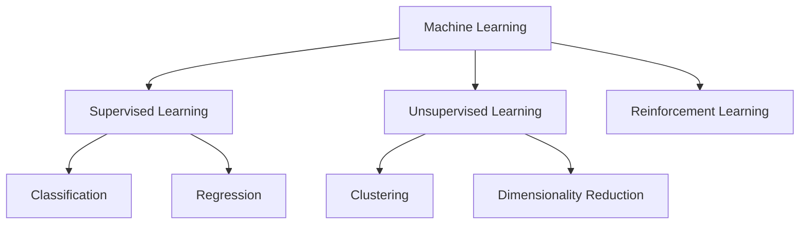
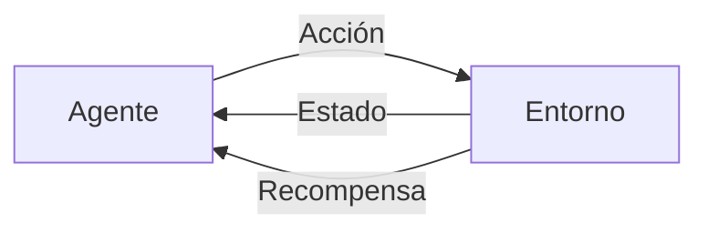
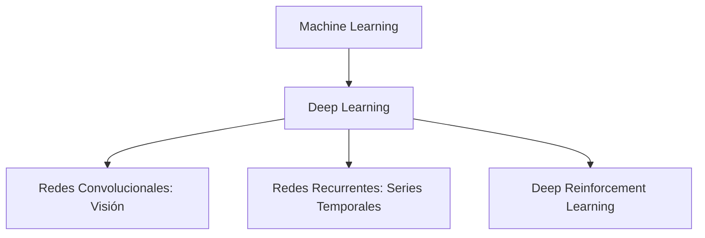

---
---
# Fundamentos Conceptuales del Machine Learning:  

## Taxonomía Principal del ML

## 1. Aprendizaje Supervisado (Supervised Learning)
### Definición
Métodos que aprenden a partir de **datos etiquetados** (ejemplo: fotos de gatos y perros previamente clasificadas por humanos).

### Subtipos Principales
| Tipo           | Característica                          | Ejemplo de Aplicación           |
|----------------|----------------------------------------|----------------------------------|
| **Clasificación** | Predice categorías discretas           | Detección de spam (Sí/No)       |
| **Regresión**    | Predice valores continuos              | Predecir precio de viviendas     |

**Ejemplo de código (Python - Scikit-learn)**:
```python
from sklearn.ensemble import RandomForestClassifier
modelo = RandomForestClassifier()
modelo.fit(X_entrenamiento, y_etiquetas)
```

## 2. 🧠 Aprendizaje No Supervisado

### 📘 Definición

El **aprendizaje no supervisado** es un enfoque de la inteligencia artificial que busca encontrar **estructuras, patrones o agrupamientos** dentro de los datos sin necesidad de etiquetas previas.  
El sistema explora los datos por sí mismo, identificando relaciones ocultas o distribuciones relevantes.

---

### 🔍 Aplicaciones Clave

#### 📊 Clustering (Agrupamiento)

Consiste en dividir los datos en grupos (clusters) que sean internamente coherentes y externamente distintos.  
Cada grupo se forma en función de la similitud entre las muestras.

#### ⚙️ Objetivo matemático típico (K-means):

$$
\text{minimizar } \sum_{i=1}^k \sum_{x \in C_i} ||x - \mu_i||^2
$$

> Donde:
> - \( C_i \) es el conjunto de puntos en el cluster \( i \)
> - \( \mu_i \) es el centroide del cluster \( i \)
> - Se busca que cada punto esté lo más cercano posible a su centroide

---

### 🧪 Otros ejemplos de aprendizaje no supervisado

- **Reducción de dimensionalidad** (PCA, t-SNE)
- **Modelado de distribuciones** (Autoencoders, GANs)
- **Segmentación de mercado** en negocios
- **Análisis de comportamiento** en datos de usuarios

## 3. Aprendizaje por Refuerzo (RL)
### Características
- Agente aprende mediante recompensas/penalizaciones
- Interactúa con un entorno dinámico

Ejemplo icónico:


AlphaGo: Aprendió a jugar Go superando a campeones humanos

## Relación con Deep Learning (DL)
Intersección Clave


## 🔍 Diferencias clave: ML Tradicional vs Deep Learning

| Característica              | ML Tradicional       | Deep Learning             |
|-----------------------------|----------------------|---------------------------|
| Extracción de features      | Manual               | Automática                |
| Rendimiento con Big Data    | Limitado             | Excelente                 |
| Interpretabilidad           | Alta                 | Baja (Black Box)          |

---

## 🤖 Ejemplo Combinado: ChatGPT

ChatGPT utiliza una combinación de enfoques de aprendizaje:

- **DL (Deep Learning):**  
  Arquitectura basada en Transformers para procesar lenguaje a escala masiva.

- **RL (Reinforcement Learning):**  
  Fine-tuning con RLHF (*Reinforcement Learning from Human Feedback*) para mejorar calidad de respuestas.

- **Supervisado:**  
  Entrenamiento inicial usando textos etiquetados para aprender lenguaje y tareas específicas.

---

👉 Esta combinación permite que el modelo aprenda patrones complejos, se ajuste con retroalimentación humana y responda con coherencia contextual.

---

## I. Regresión: El Corazón Matemático del Aprendizaje  

### ¿Qué es Regresión?  
En esencia, **encontrar la mejor curva** que explique una nube de puntos. Formalmente:  

```math  
\min_{θ} \sum_{i=1}^n (y_i - f(x_i; θ))^2
```
donde 
```math
f(x;θ)
```
es nuestro modelo y θ sus parámetros.

#### Ejemplo intuitivo:

Ajustar una recta (regresión lineal) a datos de precio de casas vs. metros cuadrados.

### Conexión con Redes Neuronales
Una red neuronal es una función paramétrica ultra-flexible:

- Capas ocultas = transformaciones no lineales
- Parámetros θ = pesos sinápticos
- Entrenar = ajustar θ para minimizar error (como en regresión, pero con gradiente descendente).

## II. 🧠 Overfitting

### ❓ ¿Qué es?

El **overfitting** ocurre cuando un modelo aprende demasiado bien los datos de entrenamiento, incluyendo el **ruido y las excepciones**, en lugar de captar los **patrones generales**.

Esto significa que cuando el modelo tiene muchos parámetros (θ) y poca señal útil en los datos, existe gran riesgo de que aprenda ruido.

---

## 🛡️ Estrategias Antídoto

### 1. 📊 Gestión Inteligente de Datos

| Conjunto      | Propósito                         | % Típico    |
|---------------|-----------------------------------|-------------|
| Entrenamiento | Ajustar parámetros (θ)            | 60–70%      |
| Validación    | Tunar hiperparámetros             | 15–20%      |
| Prueba        | Evaluación final (¡solo una vez!) | 15–20%      |

🔁 **Protocolo clave**:  
**K-fold Cross-Validation**  
→ Dividir datos en K bloques, usar K–1 para entrenar, 1 para validar, rotar el proceso.

---

### 2. 🧮 Regularización

- **L1 / L2**: Penalizan parámetros grandes para evitar sobreajuste.
```math
  $$L_{\text{total}} = L_{\text{error}} + \lambda \|θ\|^2$$
```

Penaliza parámetros demasiado grandes

λ controla la fuerza de la regularización

### Dropout:

- Apaga neuronas aleatoriamente durante entrenamiento
- Previene dependencias excesivas entre neuronas
- **Dropout**: Apagar neuronas aleatoriamente durante el entrenamiento para obligar al modelo a generalizar.

---

## Referencias

- [Análisis de la regresión](https://es.wikipedia.org/wiki/An%C3%A1lisis_de_la_regresi%C3%B3n)
- [All Machine Learning algorithms explained in 17 min](https://youtu.be/E0Hmnixke2g?si=d8TKXwt5t3kZcY8q)
