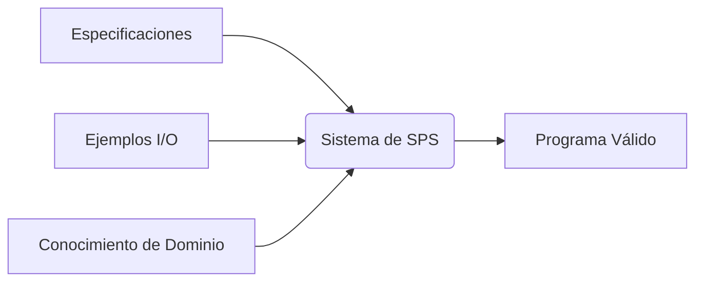

# Síntesis de Programas Simbólicos: Explicación Técnica

## Definición Conceptual
La **Síntesis de Programas Simbólicos (SPS)** es un paradigma de IA que genera programas ejecutables a partir de:
- Especificaciones de alto nivel
- Ejemplos de entrada-salida
- Restricciones lógicas

**Analogía clave**:  
"Programación automática donde el sistema 'inventa' algoritmos que satisfacen requisitos dados"

## Componentes Fundamentales


## Métodos Principales
1. Búsqueda en Espacio de Programas
- Enumeración guiada por restricciones

- Técnica: Programación lógica inductiva (ILP)

- Ejemplo:

```prolog
% Dado ejemplos, sintetiza reglas:
padre(juan,maria) → regla(X,Y) :- progenitor(X,Y), hombre(X)
```
2. Aprendizaje por Refuerzo Simbólico
- Mecanismo:

```python
recompensa = simular(programa, ejemplos)
optimizar(programa, recompensa)
```
- Aplicación: Synthesizing string transformations (Microsoft PROSE)

3. Redes Neuronales + Símbolos
## 3️⃣ Redes Neuronales + Símbolos: Aprendizaje Neuro-Simbólico

La integración de **representaciones neuronales** con **estructuras simbólicas** busca combinar la flexibilidad del aprendizaje profundo con la precisión de la lógica formal.

---

### 🧠 Dualidad de Componentes

| Parte Neuronal   | Parte Simbólica        |
|------------------|------------------------|
| Embeddings       | Reglas lógicas         |
| Clasificación    | Programas DSL (Lenguajes específicos de dominio) |

> 📌 Los embeddings capturan significado estadístico; las reglas simbólicas añaden trazabilidad y estructura.

---

### 🚀 Aplicaciones Reales

- **Auto-Excel / FlashFill**  
  Generar fórmulas automáticamente a partir de ejemplos textuales en hojas de cálculo.

- **Robótica**  
  Generar programas de control simbólico para manipuladores con aprendizaje desde sensores.

- **Ciberseguridad**  
  Sintetizar parches para vulnerabilidades mediante análisis de datos y lenguajes específicos.

---

### 🧪 Ejemplo Técnico: Sintetizador de Funciones

**Entrada:**  
> Ejemplo de texto → “Convierte ‘Juan Pérez’ en ‘J. Pérez’”

**Red Neuronal:**  
- Aprende la transformación implícita desde ejemplos (contexto semántico).

**Componente Simbólica:**  
- Traduce la tarea a un programa en DSL:  
  ```dsl
  concat(initial(first_name), " ", last_name)
```
