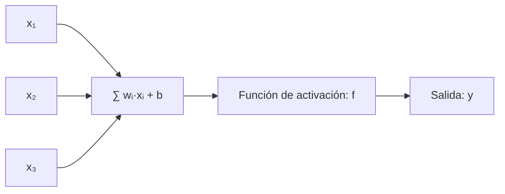
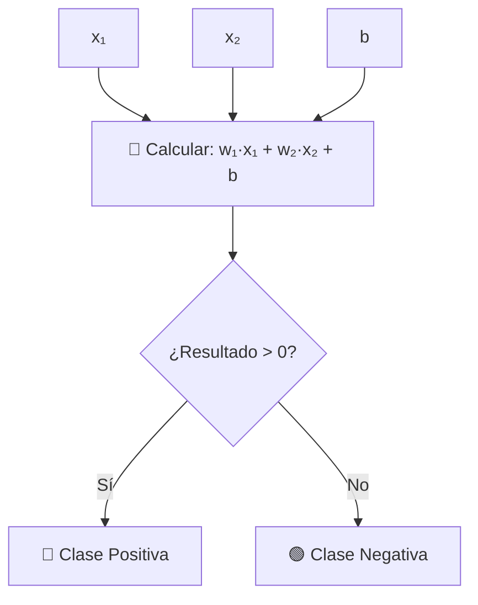

# Deep Learning: Fundamentos, Evolución y Aplicaciones en la Era de la IA Generativa

## Introducción
El **Deep Learning (DL)** es la tecnología detrás de avances revolucionarios como ChatGPT, los coches autónomos y los sistemas de diagnóstico médico. Pero, ¿cómo funciona realmente? Este ensayo explora:
1. Los **fundamentos teóricos** desde el perceptrón hasta la IA generativa.
2. La **evolución tecnológica** y su impacto en empresas.
3. La **taxonomía y diseño** de redes neuronales.
4. La relación con **LLMs, IA generativa y Reinforcement Learning**.

---

## 1. Del Perceptrón a las Redes Neuronales: Fundamentos Matemáticos

### El Perceptrón: ¿Función Lineal o No Lineal?
- **Estructura básica**:  
  Un perceptrón clásico (Rosenblatt, 1957) procesa entradas $x_1, x_2, ..., x_n$ con pesos $w_i$ y genera una salida:  
 ```math
  y = f\left(\sum_{i=1}^n w_i x_i + b\right)
 ```
  - $f$: **Función de activación** (ejemplo: escalón binario).  
  - **Teóricamente**, es lineal si $f$ es la identidad, pero al añadir \(f\) no lineal (como sigmoide), el modelo gana capacidad de aproximar funciones complejas.

- **Truco de dimensionalidad**:  
  Al extender las entradas con transformaciones no lineales (ejemplo: $x_1^2, \sin(x_2$)), el perceptrón puede modelar relaciones no lineales **sin cambiar su arquitectura**.

### Funciones de Activación: Requisitos y Evolución
Desde una perspectiva **analítica-computacional**, una buena función de activación debe:
1. Ser **no lineal** para permitir aprendizaje de patrones complejos.
2. Tener **gradientes bien comportados** (evitar el problema de vanishing/exploding gradients).
3. Ser **eficiente computacionalmente** (ejemplo: ReLU vs. sigmoide).

**Evolución histórica**:
| Era           | Función Dominante       | Limitaciones                |
|---------------|-------------------------|-----------------------------|
| 1950-2000     | Sigmoide/Tanh           | Vanishing gradients         |
| 2000-2015     | ReLU (Rectified Linear) | Muerte de neuronas (Dying ReLU) |
| 2015-Presente | Variantes de ReLU (Leaky ReLU, Swish) | Equilibrio entre estabilidad y rendimiento |


> - Las entradas \(x_1, x_2, ..., x_n\) se combinan con sus respectivos pesos.
> - Se suma un sesgo \(b\).
> - La suma se pasa por una **función de activación** \(f\), como escalón, sigmoide o ReLU.
> - El resultado es la salida del modelo \(y\).

---

### 📌 Clasificación en 2D: Ejemplo gráfico conceptual

Imaginemos que queremos separar dos clases de puntos en un plano:

```plaintext
Clase A: 🟢
Clase B: 🔴

      y
      ↑
    3 |        🟢         🔴
    2 |    🟢       🔴
    1 | 🟢      ————→ Línea de decisión
    0 |_______________________→ x
         0   1   2   3   4
```

El perceptrón busca una **línea recta** (en 2D) o **hiperplano** (en dimensiones mayores) que separe dos clases de datos.


Esto define una frontera de decisión que el modelo ajusta durante el entrenamiento.

```plaintext
Si el modelo falla:
    w_i ← w_i + η · (y_target - y_pred) · x_i
    b   ← b + η · (y_target - y_pred)
```

| Símbolo        | Significado                                |
|----------------|---------------------------------------------|
| $\eta$     | Tasa de aprendizaje (*learning rate*)       |
| $y_{\text{target}}$ | Etiqueta real de entrenamiento        |
| $y_{\text{pred}}$   | Predicción del perceptrón              |
|$w_i$    | Peso ajustado según el error                |

---

## 🧪 Ejemplo numérico de entrenamiento

### 🔹 Supuestos iniciales

- Entrada: $x = [2, -1]$
- Pesos iniciales: $w = [0.5, -0.3]$
- Sesgo: $b = 0.1$
- Tasa de aprendizaje: $\eta = 0.1$
- Etiqueta real: $y_{\text{target}} = 1$

---

### 🔹 Cálculo del valor de activación

$$
z = w_1 \cdot x_1 + w_2 \cdot x_2 + b = 0.5 \cdot 2 + (-0.3) \cdot (-1) + 0.1 = 1.0 + 0.3 + 0.1 = 1.4
$$

### 🔹 Aplicamos función escalón

Como $z = 1.4 > 0$, entonces:

$$
y_{\text{pred}} = 1
$$

---

### ✅ Comparación

Como $y_{\text{pred}} = y_{\text{target}}$, **no hay error** → el perceptrón no actualiza los pesos.

---

### ❗ Nota

Si la predicción hubiera sido incorrecta, los pesos se ajustarían usando la regla:

$$
w_i \leftarrow w_i + \eta \cdot (y_{\text{target}} - y_{\text{pred}}) \cdot x_i
$$

$$
b \leftarrow b + \eta \cdot (y_{\text{target}} - y_{\text{pred}})
$$


---

## 2. Taxonomía del Deep Learning

### Por Arquitectura
1. **Redes Feedforward (MLP)**: Capas densamente conectadas.
2. **Redes Convolucionales (CNN)**: Para imágenes (ejemplo: ResNet).
3. **Redes Recurrentes (RNN/LSTM)**: Para secuencias (ejemplo: predicción de texto).
4. **Transformers**: Base de LLMs como GPT-4 (atención multi-cabeza).

### Por Tipo de Entrada
- **Datos estructurados**: Tablas (usando MLP).
- **Imágenes/vídeo**: CNNs.
- **Texto/audio**: Transformers/RNNs.

---

## 3. Proceso de Diseño de una Red Neuronal
1. **Definir el problema**: ¿Clasificación, generación, regresión?
2. **Seleccionar arquitectura**: Basado en el tipo de dato (ejemplo: Transformers para texto).
3. **Regularización**: Dropout, BatchNorm para evitar overfitting.
4. **Entrenamiento**: Backpropagation + optimizadores (Adam, SGD).

---

## 4. Deep Learning vs. Otros Paradigmas de IA

### ¿Es DL sinónimo de "Neural Networks"?
- **Sí, pero con profundidad**: DL implica redes con múltiples capas ocultas (deep architectures), mientras que "neural networks" puede referirse a modelos superficiales.

### Relación con Otras Áreas
1. **LLMs (Large Language Models)**: Son redes basadas en Transformers entrenadas con DL.
2. **IA Generativa**: Usa DL para crear contenido (ejemplo: GANs, Diffusion Models).
3. **Reinforcement Learning**: Combina DL con retroalimentación por reward (ejemplo: AlphaGo).

---

## 5. Impacto Corporativo y Desafíos
- **Aplicaciones empresariales**:
  - Automatización de procesos (chatbots, análisis de documentos).
  - Personalización (recomendaciones en e-commerce).
- **Riesgos**:
  - Sesgos en datos.
  - Alta demanda energética (entrenar GPT-3 ≈ 1,300 MWh).

---

## Conclusión
El Deep Learning ha evolucionado desde modelos lineales simples hasta sistemas generativos complejos. Su éxito se basa en:
1. **Avances teóricos** (funciones de activación, arquitecturas).
2. **Hardware** (GPUs/TPUs).
3. **Datos masivos**.  
Para las empresas, entender estos fundamentos es clave para implementar soluciones éticas y eficientes.
