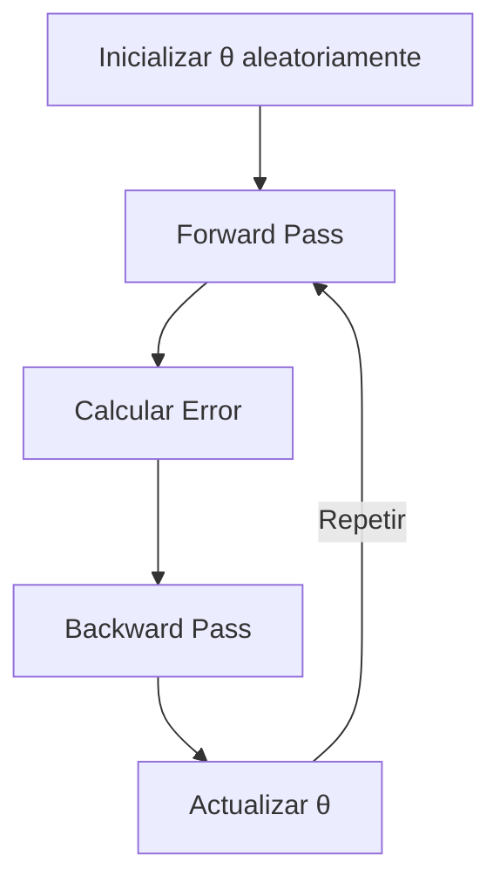
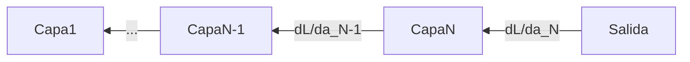
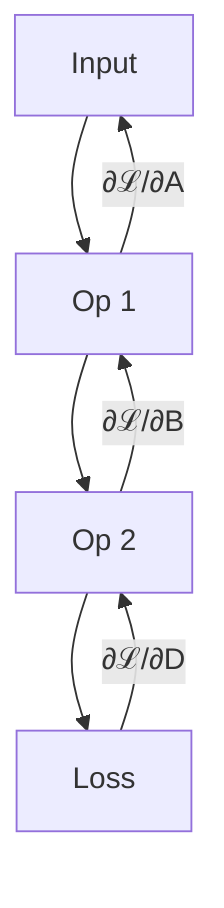

# Aprendizaje Automático como Optimización Matemática:  
---

## I. La Esencia Matemática del Aprendizaje  

### 1. Redes Neuronales: Composición de Funciones  
Una red neuronal es esencialmente:  

```math  
f(x) = (f_L ∘ f_{L-1} ∘ ... ∘ f_1)(x)
```
Donde cada capa f_i es una transformación parametrizable:
```math
f_i(x) = σ(W_i x + b_i)
```
- σ: Función de activación no lineal (ReLU, sigmoide)

- W_i, b_i: Parámetros entrenables

Analogía:

> "Como una cadena de fábricas donde cada etapa (capa) transforma la materia prima (datos) usando maquinaria ajustable (parámetros)"

## II. El Proceso de Optimización
### 2.1 La Función de Pérdida (Loss Function)
Objetivo cuantificable:

```math
\min_θ \frac{1}{n}\sum_{i=1}^n ℓ(y_i, f(x_i; θ))
```
Ejemplos comunes:

- MSE (regresión)
- Entropía cruzada (clasificación)

## 2.2 Descenso de Gradiente: El Algoritmo Fundamental

### Ciclo Iterativo de Dos Pasos

| **Paso**            | **Matemáticas**                          | **Computación**               |
|---------------------|-----------------------------------------|-------------------------------|
| **Forward Pass**    | Evaluar `f(x;θ)`                        | Propagación de la entrada     |
| **Backward Pass**   | Calcular `∇_θ ℓ` (regla de la cadena)   | Backpropagation               |

### Actualización de Parámetros
```math
θ_{t+1} = θ_t - η ∇_θ ℓ
```
## Proceso de Descenso de Gradiente

### Componentes Clave
Donde:
- **η (eta)**: Tasa de aprendizaje (*learning rate*)
  - Controla el tamaño de cada paso de actualización
- **∇_θ ℓ**: Gradiente de la función de pérdida respecto a θ
  - Indica la dirección de máximo crecimiento del error

### Visualización del Proceso


## Claves Conceptuales del Descenso de Gradiente

### Forward Pass (Paso hacia adelante)
- **Objetivo**: Calcular la predicción del modelo
- **Operación en cada capa**:
  ```math
  f(x) = \sigma(W \cdot x + b)
  ```
  ## Componentes y Procesos Clave en Redes Neuronales

### Definiciones Fundamentales

Donde:
- `σ`: **Función de activación no lineal**  
  Ejemplos comunes:  
  - ReLU: `max(0, x)`  
  - Sigmoide: `1/(1 + e^{-x})`  
  - Tanh: `(e^x - e^{-x})/(e^x + e^{-x})`  

- `W`: **Matriz de pesos** de la capa  
  - Dimensiones: `(neuronas_salida × neuronas_entrada)`  
  - Inicialización típica: He, Xavier/Glorot  

- `b`: **Vector de sesgo** (bias)  
  - Dimensión: `(neuronas_salida × 1)`  
  - Permite desplazar la función de activación  

### Forward Pass: Proceso de Propagación
1. **Flujo de datos**:  
   - Entrada → Capa 1 → Capa 2 → ... → Capa N → Salida  
2. **Operación por capa**:  
   ```math
   a^{(l)} = σ(W^{(l)} a^{(l-1)} + b^{(l)})
   ```

Donde:
- `a^{(l)}`: **Activación de la capa actual**  
  - Vector de salida de la capa `l` después de aplicar la función de activación
  - Dimensión: `(n_neurons_l × 1)`

- `a^{(l-1)}`: **Activación de la capa anterior**  
  - Vector de entrada para la capa `l`  
  - Corresponde a la salida de la capa `l-1`

### Backward Pass: Retropropagación
**Flujo del gradiente**:


## Explicación del Diagrama de Retropropagación

### Dirección del Flujo
El gradiente fluye en dirección inversa al forward pass:
- **Desde**: La capa de salida (capa N)
- **Hacia**: La capa de entrada (capa 1)

### Qué se Propaga
| Símbolo | Descripción | Dimensión |
|---------|-------------|-----------|
| `∂ℒ/∂a(l)` | Gradiente de la pérdida respecto a las activaciones de la capa l | (n_neurons_l × 1) |
| `∂ℒ/∂W(l)` | Gradiente respecto a los pesos de la capa l | (n_neurons_l × n_neurons_{l-1}) |
| `∂ℒ/∂b(l)` | Gradiente respecto a los biases de la capa l | (n_neurons_l × 1) |

### Regla de la Cadena (Descomposición Matemática)
```math
\frac{∂ℒ}{∂a^{(l-1)}} = \frac{∂ℒ}{∂a^{(l)}} \cdot \frac{∂a^{(l)}}{∂a^{(l-1)}}
```
## Detalles Matemáticos y Implementación

### Notación Matemática
Donde:
- `·` representa **multiplicación matricial**  
  - Ejemplo: Si `A` es (m×n) y `B` es (n×p), entonces `A·B` es (m×p)
- Cada término en la regla de la cadena es una **matriz Jacobiana**:
  ```math
  \frac{∂a^{(l)}}{∂a^{(l-1)}} = W^{(l)} \odot \sigma'(z^{(l)})
   ```
Donde ⊙ es producto Hadamard (element-wise) y σ' la derivada de la función de activación

Implementación Práctica con Autograd
Frameworks modernos automatizan este proceso:

PyTorch: loss.backward()

TensorFlow: tape.gradient(loss, variables)

Ejemplo completo:

```python
import torch

# Forward pass
outputs = model(inputs)
loss = criterion(outputs, targets)

# Backward pass (computa todos los gradientes automáticamente)
loss.backward()  # Calcula ∂ℒ/∂W y ∂ℒ/∂b para todos los parámetros

# Actualización (optimizer.step() usa los gradientes calculados)
optimizer.step()
```
## Flujo de Autograd en Deep Learning

### Proceso de Cálculo de Gradientes

1. **Gráfico Computacional Dinámico**
   - Registra automáticamente todas las operaciones durante el forward pass
   - Crea un DAG (Grafo Acíclico Dirigido) de operaciones
   - Ejemplo de operaciones registradas:
     - Multiplicaciones matriciales
     - Funciones de activación
     - Operaciones de reducción (suma, promedio)

2. **Regla de la Cadena Inversa (Backpropagation)**
   - Calcula gradientes eficientemente desde la salida hacia la entrada
   - Características clave:
     - Evita recálculos redundantes
     - Optimiza el orden de cálculo
     ```math
     \frac{∂ℒ}{∂x} = \sum_{i} \frac{∂ℒ}{∂y_i} \frac{∂y_i}{∂x}
     ```

3. **Acumulación de Gradientes**
   - Suma gradientes automáticamente cuando existen rutas múltiples
   - Casos comunes de acumulación:
     - Redes con conexiones residuales
     - Modelos con múltiples pérdidas
     - Parámetros compartidos

### Comparación con Otros Métodos
| Método                      | Ventajas                           | Limitaciones                     |
|-----------------------------|------------------------------------|----------------------------------|
| **Diferenciación Automática** | - Exacta <br> - Eficiente memoria | - Requiere implementación framework |
| **Diferenciación Simbólica** | - Expresión analítica              | - Explosión computacional        |
| **Diferenciación Numérica**  | - Fácil implementación            | - Inexacta <br> - Costosa computacionalmente |

> **Nota clave**: PyTorch/TensorFlow usan AD por:
> 1. Precisión matemática exacta
> 2. Eficiencia computacional (O(n) en memoria)
> 3. Escalabilidad a millones de parámetros

### Ejemplo Visual

