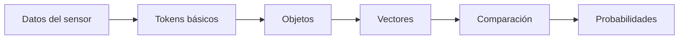
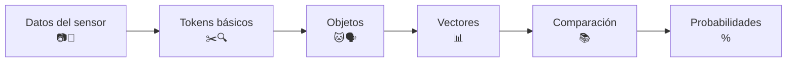

---
---
# Cómo las Máquinas Aprenden a Ver y Oír: Un Viaje desde los Píxeles hasta el Entendimiento  

---

## Introducción: El Misterio de los Sentidos Artificiales  
Imagina que le pides a un niño que identifique un gato en una foto. Lo hace instantáneamente, pero para una IA, este proceso es un viaje fascinante a través de capas de abstracción. Hoy exploraremos cómo los datos crudos de sensores (cámaras, micrófonos) se transforman en **reconocimiento de patrones**.

---

## Paso 1: Del Mundo Físico a los Números  
**Datos del sensor → Señal digital**  
- **Cámara**: Cada píxel es un número (ej: `[R=120, G=80, B=200]`).  
- **Micrófono**: Ondas sonoras → números (amplitud cada 1/44,100 segundos).  

---

## Paso 2: Extracción de "Tokens" (Fragmentos Significativos)  
**Buscar patrones locales**:  
- En imágenes: Bordes, texturas (usando *filtros convolucionales*).  
- En audio: Silabas o notas (con *transformadas de Fourier*).  

*Ejemplo*:  
```python  
# Filtro para detectar bordes verticales (Sobel) 
filtro = [[-1, 0, 1],  
          [-1, 0, 1],  
          [-1, 0, 1]]
```

## Paso 3: Agrupación en Objetos  
**De tokens a "cosas"**  

La IA agrupa tokens relacionados:  
- **Imágenes**:  
  - Bordes → Formas → Rostro de gato  
- **Audio**:  
  - Sonidos → Fonemas → Palabra "hola"  

**Analogía**:  
> *"Como armar un rompecabezas donde primero encuentras las esquinas, luego los bordes, y finalmente la imagen completa"*  

---

## Paso 4: Generación de Representaciones de Alto Nivel  
**Abstracción matemática**:  
- Cada objeto se convierte en un **vector** (lista de números que captura sus características).  
- Ejemplo para un gato:

```text
[0.8, 0.1, 0.05, ...] → (pelaje, bigotes, ojos, ...)  
```

## Paso 5: Comparación con el "Diccionario" del Mundo
### Base de conocimiento:

La IA tiene un "diccionario" de vectores pre-entrenados (ej: gato = [0.7, 0.2, ...]).

Usa similitud coseno para comparar:
```math
\text{similitud} = \frac{A \cdot B}{\|A\| \|B\|}  
```

## Paso 6: La Decisión Final (Vector de Probabilidades)
### "¿Qué es esto?":

La IA devuelve probabilidades:

```json
{"gato": 0.92, "perro": 0.05, "oso": 0.03}
```

Cómo lo hace:

Función softmax convierte números en probabilidades.

## Resumen Visual: El Pipeline Completo





## Referencias

- [Exploring how the applications of computer vision work](https://www.ultralytics.com/blog/exploring-how-the-applications-of-computer-vision-work)
- [TensorFlow Playground](https://playground.tensorflow.org/#activation=tanh&batchSize=10&dataset=circle&regDataset=reg-plane&learningRate=0.03&regularizationRate=0&noise=0&networkShape=4,2&seed=0.99141&showTestData=false&discretize=false&percTrainData=50&x=true&y=true&xTimesY=false&xSquared=false&ySquared=false&cosX=false&sinX=false&cosY=false&sinY=false&collectStats=false&problem=classification&initZero=false&hideText=false)
